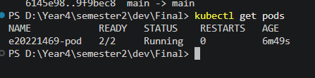
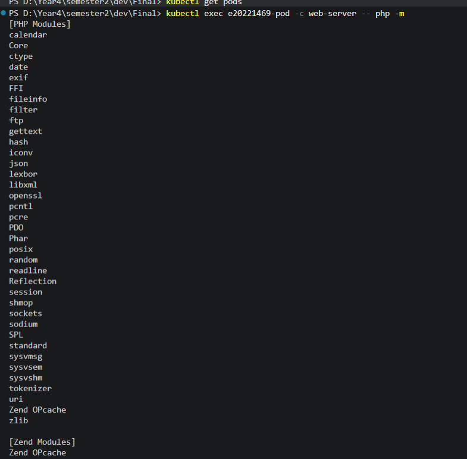
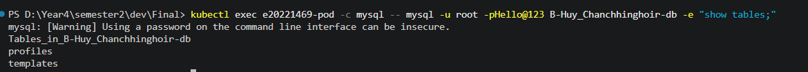
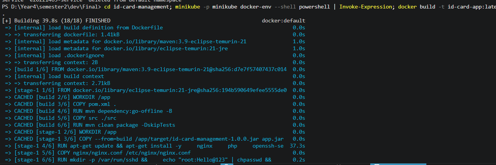
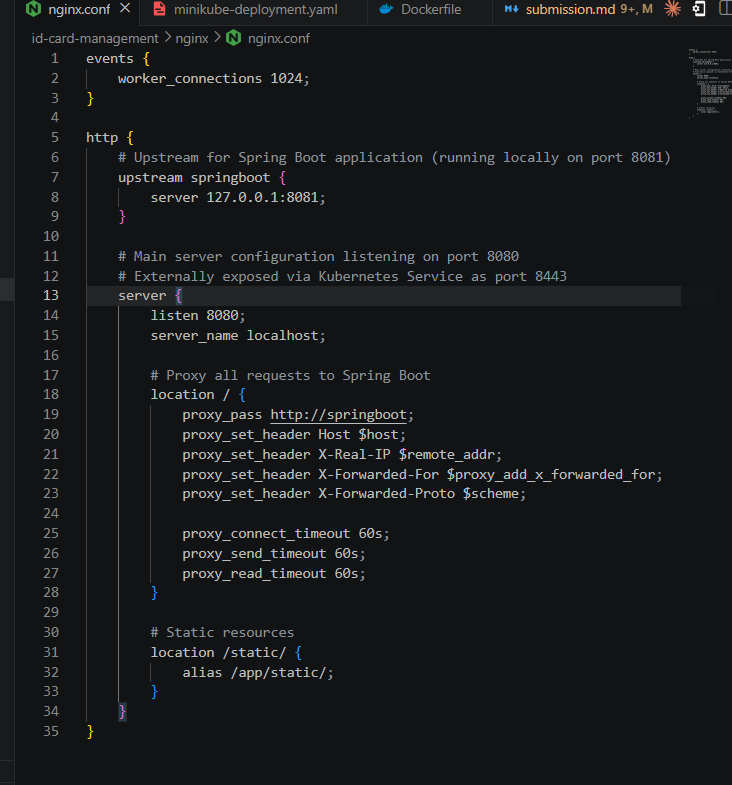

# DevOps Exam Submission - ID Card Management System (Kubernetes)

## Student Information
- **Name:** HUY Chanchhinghoir
- **ID:** 20221469
- **Group:** B
- **Date:** June 17, 2026

## Repository Information
- **GitHub URL:** https://github.com/ChingHoir/Final-devop.git
- **Branch:** main
- **Latest Commit:** `6145e98`

---

## Task 1: Kubernetes Configuration (CHOICE_B - Kubernetes Pod)

### YAML File Created
**File:** `id-card-management/kubernetes/minikube-deployment.yaml`


### Pod Configuration Summary
| Item | Value |
|------|-------|
| **Pod Name** | `e20221469-pod` |
| **Web Container** | `web-server` (JDK 21 + NGINX + Spring Boot + PHP + SSH) |
| **DB Container** | `mysql` (MySQL 8.0) |
| **Database Name** | `B-Huy_Chanchhinghoir-db` |
| **DB User/Password** | `root` / `Hello@123` |
| **NGINX Port** | 8080 (exposed as 8443 via Service) |
| **SSH Port** | 22 (exposed as 2222 via Service) |
| **Website NodePort** | 30843 |
| **SSH NodePort** | 30222 |

### Verification Commands & Output


---

## Task 2: Web Container - PHP Modules Output

### Command Executed
```bash
kubectl exec e20221469-pod -c web-server -- php -m
```

### Output (saved to `php-modules.txt`)

**File location:** `php-modules.txt` (repository root)

---

## Task 3: MySQL Container - Show Tables Output

### Command Executed
```bash
kubectl exec e20221469-pod -c mysql -- mysql -u root -pHello@123 B-Huy_Chanchhinghoir-db -e "show tables;"
```

### Output (saved to `mysql-tables.txt`)


**File location:** `mysql-tables.txt` (repository root)

---

## Task 4: Git Commands

```bash
# Add Kubernetes YAML file
git add id-card-management/kubernetes/minikube-deployment.yaml

# Add PHP modules output
git add php-modules.txt

# Add MySQL tables output
git add mysql-tables.txt

# Add Dockerfile and nginx config
git add id-card-management/Dockerfile id-card-management/nginx/nginx.conf

# Commit all files
git commit -m "add Kubernetes deployment, PHP modules, MySQL tables, and configuration files"

# Push to GitHub
git push origin main
```

### Commit Details
- **Commit Hash:** `6145e98`
- **Commit Message:** "add Kubernetes deployment, PHP modules, MySQL tables, and configuration files"

---

## Dockerfile Configuration

**File:** `id-card-management/Dockerfile`

The Dockerfile uses a multi-stage build:
1. **Build stage**: Maven 3.9 + JDK 21 to compile the Spring Boot application
2. **Runtime stage**: JDK 21 JRE with:
   - NGINX (web server, port 8080, proxies to Spring Boot on 8081)
   - PHP (for `php -m` command)
   - OpenSSH Server (port 22, root user with password `Hello@123`)
   - MySQL client (for waiting until MySQL is ready)

### Docker Build Command


---

## NGINX Configuration

**File:** `id-card-management/nginx/nginx.conf`

NGINX listens on port 8080 and proxies all requests to Spring Boot running on port 8081:


---

## Submission Checklist

- [x] Kubernetes Pod YAML file created (`minikube-deployment.yaml`)
- [x] Kubernetes Service YAML file created (same file)
- [x] YAML file committed to GitHub
- [x] PHP modules saved to `php-modules.txt` at repo root
- [x] `php-modules.txt` committed to GitHub
- [x] MySQL tables saved to `mysql-tables.txt` at repo root
- [x] `mysql-tables.txt` committed to GitHub
- [x] Docker image built successfully
- [x] Pod is running with 2/2 containers
- [x] All files pushed to GitHub repository
- [x] Repository URL: https://github.com/ChingHoir/Final-devop.git

---

## Application Access

| Service | URL/Command |
|---------|-------------|
| **Website** | http://localhost:30843 (via NodePort) |
| **SSH Access** | `ssh root@localhost -p 30222` (password: Hello@123) |
| **Database** | `B-Huy_Chanchhinghoir-db` on 127.0.0.1:3306 |

---

**Date:** June 17, 2026  
**Submitted by:** HUY Chanchhinghoir (ID: 20221469 - Group B)