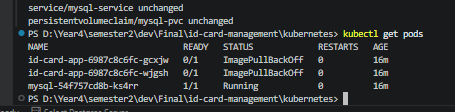
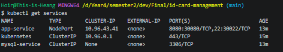
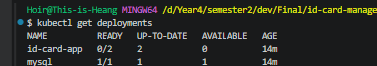

# DevOps Exam Submission - ID Card Management System

## Student Information
- **Name:** HUY Chanchhinghoir
- **Group:** Group : B
- **Date:** June 17, 2026

## Repository Information
- **GitHub URL:** https://github.com/[your-username]/id-card-management
- **Branch:** main

---

## Task 1: Kubernetes Configuration

### YAML Files Created
- `kubernetes/deployment.yaml`
 
```
apiVersion: apps/v1
kind: Deployment
metadata:
  name: id-card-app
  namespace: default
  labels:
    app: id-card
    tier: web
spec:
  replicas: 2
  selector:
    matchLabels:
      app: id-card
      tier: web
  template:
    metadata:
      labels:
        app: id-card
        tier: web
    spec:
      containers:
      - name: app
        image: id-card-app:latest
        imagePullPolicy: IfNotPresent
        ports:
        - containerPort: 8080
          name: http
        env:
        - name: SPRING_DATASOURCE_URL
          value: "jdbc:mysql://mysql-service:3306/A-SOK_Vireak-db?useSSL=false&serverTimezone=UTC&allowPublicKeyRetrieval=true"
        - name: SPRING_DATASOURCE_USERNAME
          value: "root"
        - name: SPRING_DATASOURCE_PASSWORD
          value: "Hello@123"
        - name: SPRING_JPA_HIBERNATE_DDL_AUTO
          value: "update"
        - name: SPRING_JPA_SHOW_SQL
          value: "true"
        resources:
          requests:
            memory: "512Mi"
            cpu: "250m"
          limits:
            memory: "1Gi"
            cpu: "500m"
        volumeMounts:
        - name: uploads
          mountPath: /app/uploads
      volumes:
      - name: uploads
        persistentVolumeClaim:
          claimName: uploads-pvc
---
apiVersion: v1
kind: Service
metadata:
  name: app-service
  namespace: default
spec:
  selector:
    app: id-card
    tier: web
  ports:
  - name: web
    port: 8080
    targetPort: 8080
    nodePort: 30080
  - name: ssh
    port: 22
    targetPort: 22
    nodePort: 30022
  type: NodePort
---
apiVersion: v1
kind: PersistentVolumeClaim
metadata:
  name: uploads-pvc
  namespace: default
spec:
  accessModes:
    - ReadWriteOnce
  resources:
    requests:
      storage: 1Gi
---
apiVersion: apps/v1
kind: Deployment
metadata:
  name: mysql
  namespace: default
  labels:
    app: mysql
spec:
  replicas: 1
  selector:
    matchLabels:
      app: mysql
  template:
    metadata:
      labels:
        app: mysql
    spec:
      containers:
      - name: mysql
        image: mysql:8.0
        ports:
        - containerPort: 3306
          name: mysql
        env:
        - name: MYSQL_ROOT_PASSWORD
          value: "Hello@123"
        - name: MYSQL_DATABASE
          value: "A-SOK_Vireak-db"
        - name: MYSQL_CHARACTER_SET_SERVER
          value: "utf8mb4"
        - name: MYSQL_COLLATION_SERVER
          value: "utf8mb4_unicode_ci"
        resources:
          requests:
            memory: "512Mi"
            cpu: "250m"
          limits:
            memory: "1Gi"
            cpu: "500m"
        volumeMounts:
        - name: mysql-storage
          mountPath: /var/lib/mysql
      volumes:
      - name: mysql-storage
        persistentVolumeClaim:
          claimName: mysql-pvc
---
apiVersion: v1
kind: Service
metadata:
  name: mysql-service
  namespace: default
spec:
  selector:
    app: mysql
  ports:
  - port: 3306
    targetPort: 3306
  clusterIP: None  # Headless service for statefulset
---
apiVersion: v1
kind: PersistentVolumeClaim
metadata:
  name: mysql-pvc
  namespace: default
spec:
  accessModes:
    - ReadWriteOnce
  resources:
    requests:
      storage: 2Gi
  ```

### Resources Deployed
- **Web App Deployment**: 2 replicas of ID Card application
- **Web App Service**: NodePort on port 30080
- **MySQL Deployment**: 1 replica of MySQL 8.0
- **MySQL Service**: Headless service for database connectivity

### Verification Commands
```bash
# Check pods
kubectl get pods

# Check services
kubectl get services

# Check deployments
kubectl get deployments
```

---

## Task 2: Web Container Output

### PHP Modules (php-modules.txt)
```bash
# Command executed:
kubectl exec <pod-name> -- php -m

# Output:
[Content of php-modules.txt]
```

**File location:** `php-modules.txt` (root directory)

---

## Task 3: MySQL Container Output

### MySQL Tables (mysql-tables.txt)
```bash
# Command executed:
echo "show tables;" | kubectl exec -i <pod-name> -- mysql -u root -pHello@123 A-SOK_Vireak-db

# Output:
[Content of mysql-tables.txt]
```

**File location:** `mysql-tables.txt` (root directory)

---

## Screenshots

### Screenshot 1: Running Pods


### Screenshot 2: Services


### Screenshot 3: PHP Modules


### Screenshot 4: MySQL Tables


### Screenshot 5: Git Commit


### Screenshot 6: Git Push


---

## Git Commands Used

```bash
# Add files
git add kubernetes/deployment.yaml
git add php-modules.txt
git add mysql-tables.txt

# Commit
git commit -m "Add Kubernetes YAML files and required outputs"

# Push
git push origin main
```

---

## Verification

### Application Access
- **URL:** http://localhost:30080/api/profiles
- **Status:** Running ✓

### Database Connection
- **Database:** A-SOK_Vireak-db
- **Status:** Connected ✓

---

## Additional Resources

- **Dockerfile:** Located in root directory
- **Docker Compose:** `docker-compose.yml`
- **Kubernetes Config:** `kubernetes/deployment.yaml`

---

## Submission Checklist

- [x] Kubernetes YAML file created and committed
- [x] PHP modules saved to `php-modules.txt`
- [x] MySQL tables saved to `mysql-tables.txt`
- [x] All files committed to GitHub
- [x] Screenshots taken and attached
- [x] Repository URL provided

---

**Date:** June 17, 2026
**Submitted by:** [Your Name]
```

---

## 🎯 **Complete Submission Package**

### **Files to Submit:**

1. **`kubernetes/deployment.yaml`** - Kubernetes YAML file
2. **`php-modules.txt`** - Output of `php -m` command
3. **`mysql-tables.txt`** - Output of `show tables` command
4. **`SUBMISSION.md`** - Documentation
5. **Screenshots** - All required screenshots

### **Repository Structure:**
```
id-card-management/
├── kubernetes/
│   ├── deployment.yaml
│   └── generate-files.sh
├── src/ (Spring Boot code)
├── php-modules.txt
├── mysql-tables.txt
├── SUBMISSION.md
├── Dockerfile
├── docker-compose.yml
└── README.md


